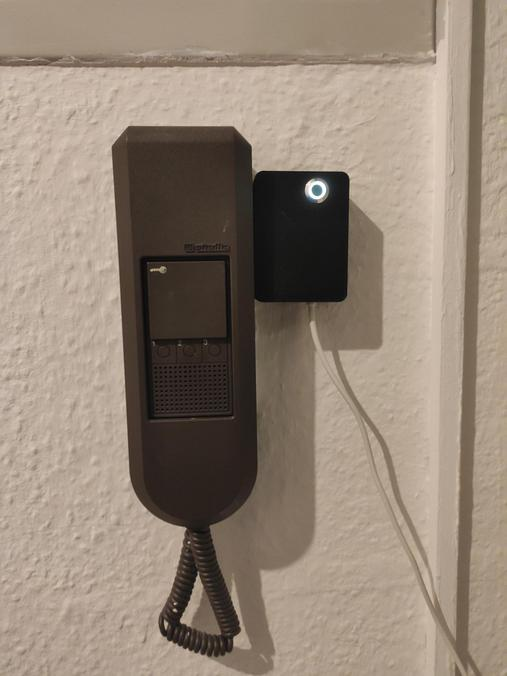

# Belliot
Door Bell IoT Hardware.
Made with Kicad.

Used to make my door intercom system a bit more smarter. I have a Siedle HT511-01 which I wanted to control from Home Assistant.

## Features
+ Mute bell via relay
+ Actuate door opener via relay
+ One button to mute/unmute bell at the hardware
+ One LED to indicate mute state

## Hardware
+ ESP8266 WeMos D1 Mini
+ AC Optocoupler VOS628A-3T
+ 2x Relais G6K-2F-Y

## Housing
Todo

## Software
The software repository is [belliot_sw](https://github.com/vondraussen/belliot_sw).
